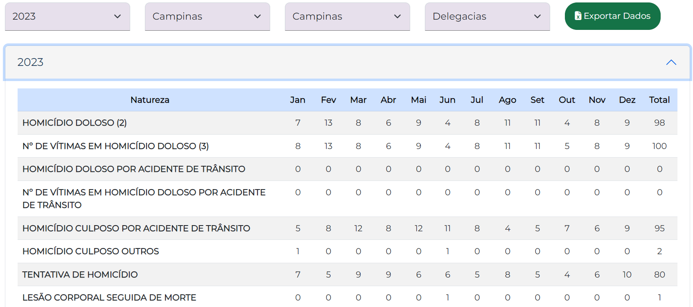

# Processamento dos dados SSP-SP (Secrataria da Segurança Pública do Governo de São Paulo)

Com o intuito de explorar os dados abertos disponíveis que circundam a temática de Análise criminal, optou-se por, inicialmente, extrair as informações da SSP-SP. 
    
Para isso, foi necessário criar um script .py com ***Selenium***, uma vez que o website https://www.ssp.sp.gov.br/estatistica/dados-mensais apenas fornece um único download por município, e isso seria inviável de ser realizado manualmente.

  
  
<em>Exemplo de base: ano: 2023, Região: Campinas, Município: Campinas</em>

Após o download da amostra dos anos de 2023 e 2024 para a região de Campinas, totalizou-se 76 dataframes (38 para cada ano), os quais foram segmentados por tipo de crime. A agregação e o tratamento dessas bases foram feitas a partir do notebook ***tratamento_bases.ipynb*** em conjunto com os códigos dos municípios fornecidos pela ***SEADE***. Assim, obteve-se, como resultado, um dicionário em que as chaves são os tipos de crime listados no website da SSP-SP e seus respectivos valores são os dataframes com os registros criminais para cada município.

| municipios            |   cod_ibge | reg_administrativa   | reg_metropolitanas   |   Janeiro 2024 |   Fevereiro 2024 |   Marco 2024 |   Abril 2024 |   Maio 2024 |   Junho 2024 |   Julho 2024 |   Agosto 2024 |   Setembro 2024 |   Outubro 2024 |   Novembro 2024 |   Dezembro 2024 |   Total |
|:----------------------|-----------:|:---------------------|:---------------------|---------------:|-----------------:|-------------:|-------------:|------------:|-------------:|-------------:|--------------:|----------------:|---------------:|----------------:|----------------:|--------:|
| Amparo                |    3501905 | RA de Campinas       | Demais municípios    |              0 |                0 |            0 |            0 |           0 |            0 |            0 |             0 |               0 |              0 |               0 |               0 |       0 |
| Atibaia               |    3504107 | RA de Campinas       | Demais municípios    |              2 |                1 |            1 |            1 |           2 |            0 |            0 |             0 |               0 |              0 |               0 |               0 |       7 |
| Bom Jesus dos Perdões |    3507100 | RA de Campinas       | Demais municípios    |              0 |                0 |            0 |            0 |           0 |            0 |            0 |             0 |               0 |              0 |               0 |               0 |       0 |
| Bragança Paulista     |    3507605 | RA de Campinas       | Demais municípios    |              0 |                1 |            2 |            0 |           1 |            0 |            0 |             0 |               0 |              0 |               0 |               0 |       4 |
| Cabreúva              |    3508405 | RA de Campinas       | RM de Jundiai        |              0 |                0 |            0 |            0 |           2 |            0 |            0 |             0 |               0 |              0 |               0 |               0 |       2 |
| Campinas              |    3509502 | RA de Campinas       | RM de Campinas       |              5 |                5 |            7 |            5 |           5 |            7 |            0 |             0 |               0 |              0 |               0 |               0 |      34 |
| Campo Limpo Paulista  |    3509601 | RA de Campinas       | RM de Jundiai        |              1 |                1 |            0 |            1 |           0 |            0 |            0 |             0 |               0 |              0 |               0 |               0 |       3 |
| Estiva Gerbi          |    3557303 | RA de Campinas       | Demais municípios    |              0 |                0 |            0 |            0 |           0 |            0 |            0 |             0 |               0 |              0 |               0 |               0 |       0 |
| Holambra              |    3519055 | RA de Campinas       | RM de Campinas       |              0 |                0 |            0 |            0 |           1 |            1 |            0 |             0 |               0 |              0 |               0 |               0 |       2 |
| Indaiatuba            |    3520509 | RA de Campinas       | RM de Campinas       |              0 |                0 |            2 |            2 |           0 |            0 |            0 |             0 |               0 |              0 |               0 |               0 |       4 |
| Itapira               |    3522604 | RA de Campinas       | Demais municípios    |              0 |                2 |            0 |            1 |           0 |            0 |            0 |             0 |               0 |              0 |               0 |               0 |       3 |
| Itatiba               |    3523404 | RA de Campinas       | RM de Campinas       |              0 |                1 |            1 |            1 |           0 |            1 |            0 |             0 |               0 |              0 |               0 |               0 |       4 |
| Itupeva               |    3524006 | RA de Campinas       | RM de Jundiai        |              1 |                0 |            0 |            0 |           0 |            1 |            0 |             0 |               0 |              0 |               0 |               0 |       2 |
| Jaguariúna            |    3524709 | RA de Campinas       | RM de Campinas       |              0 |                0 |            0 |            1 |           0 |            0 |            0 |             0 |               0 |              0 |               0 |               0 |       1 |
| Jarinu                |    3525201 | RA de Campinas       | RM de Jundiai        |              0 |                0 |            1 |            0 |           0 |            0 |            0 |             0 |               0 |              0 |               0 |               0 |       1 |
| Joanópolis            |    3525508 | RA de Campinas       | Demais municípios    |              0 |                0 |            0 |            0 |           0 |            0 |            0 |             0 |               0 |              0 |               0 |               0 |       0 |
| Jundiaí               |    3525904 | RA de Campinas       | RM de Jundiai        |              4 |                1 |            1 |            3 |           2 |            2 |            0 |             0 |               0 |              0 |               0 |               0 |      13 |
| Lindóia               |    3527009 | RA de Campinas       | Demais municípios    |              0 |                0 |            0 |            0 |           0 |            0 |            0 |             0 |               0 |              0 |               0 |               0 |       0 |
| Louveira              |    3527306 | RA de Campinas       | RM de Jundiai        |              0 |                0 |            2 |            0 |           0 |            1 |            0 |             0 |               0 |              0 |               0 |               0 |       3 |
| Mogi Guaçu            |    3530706 | RA de Campinas       | Demais municípios    |              0 |                1 |            1 |            0 |           1 |            4 |            0 |             0 |               0 |              0 |               0 |               0 |       7 |
| Monte Alegre do Sul   |    3531209 | RA de Campinas       | Demais municípios    |              0 |                0 |            0 |            0 |           0 |            0 |            0 |             0 |               0 |              0 |               0 |               0 |       0 |
| Morungaba             |    3532009 | RA de Campinas       | RM de Campinas       |              0 |                0 |            0 |            1 |           0 |            0 |            0 |             0 |               0 |              0 |               0 |               0 |       1 |
| Nazaré Paulista       |    3532405 | RA de Campinas       | Demais municípios    |              0 |                1 |            0 |            0 |           1 |            0 |            0 |             0 |               0 |              0 |               0 |               0 |       2 |
| Paulínia              |    3536505 | RA de Campinas       | RM de Campinas       |              0 |                2 |            1 |            2 |           0 |            0 |            0 |             0 |               0 |              0 |               0 |               0 |       5 |
| Pedra Bela            |    3536802 | RA de Campinas       | Demais municípios    |              0 |                0 |            0 |            0 |           0 |            1 |            0 |             0 |               0 |              0 |               0 |               0 |       1 |
| Pedreira              |    3537107 | RA de Campinas       | RM de Campinas       |              0 |                0 |            0 |            0 |           1 |            0 |            0 |             0 |               0 |              0 |               0 |               0 |       1 |
| Pinhalzinho           |    3538204 | RA de Campinas       | Demais municípios    |              0 |                0 |            0 |            0 |           0 |            0 |            0 |             0 |               0 |              0 |               0 |               0 |       0 |
| Piracaia              |    3538600 | RA de Campinas       | Demais municípios    |              0 |                0 |            0 |            0 |           0 |            0 |            0 |             0 |               0 |              0 |               0 |               0 |       0 |
| Serra Negra           |    3551603 | RA de Campinas       | Demais municípios    |              0 |                0 |            0 |            0 |           0 |            0 |            0 |             0 |               0 |              0 |               0 |               0 |       0 |
| Socorro               |    3552106 | RA de Campinas       | Demais municípios    |              1 |                1 |            0 |            0 |           0 |            0 |            0 |             0 |               0 |              0 |               0 |               0 |       2 |
| Tuiuti                |    3554953 | RA de Campinas       | Demais municípios    |              0 |                0 |            0 |            0 |           0 |            0 |            0 |             0 |               0 |              0 |               0 |               0 |       0 |
| Valinhos              |    3556206 | RA de Campinas       | RM de Campinas       |              1 |                0 |            0 |            0 |           0 |            0 |            0 |             0 |               0 |              0 |               0 |               0 |       1 |
| Vargem                |    3556354 | RA de Campinas       | Demais municípios    |              0 |                0 |            0 |            0 |           0 |            0 |            0 |             0 |               0 |              0 |               0 |               0 |       0 |
| Vinhedo               |    3556701 | RA de Campinas       | RM de Campinas       |              1 |                2 |            1 |            0 |           1 |            0 |            0 |             0 |               0 |              0 |               0 |               0 |       5 |
| Várzea Paulista       |    3556503 | RA de Campinas       | RM de Jundiai        |              0 |                0 |            1 |            0 |           0 |            0 |            0 |             0 |               0 |              0 |               0 |               0 |       1 |
| Águas de Lindóia      |    3500501 | RA de Campinas       | Demais municípios    |              0 |                0 |            0 |            0 |           0 |            0 |            0 |             0 |               0 |              0 |               0 |               0 |       0 |

  
<em>Exemplo da base pós-processada de registros criminais de 2024 - tentativa_de_homicídio</em>

# Considerações finais para a agregação da base no projeto

Optou-se por utilizar os dados do período 2010-2022 

Erros na variável 'estupro', que podem ser acessadas pela a variável "total_estupro(4)". Que considera a soma entre os estupros e os estupros de vulneráveis.

